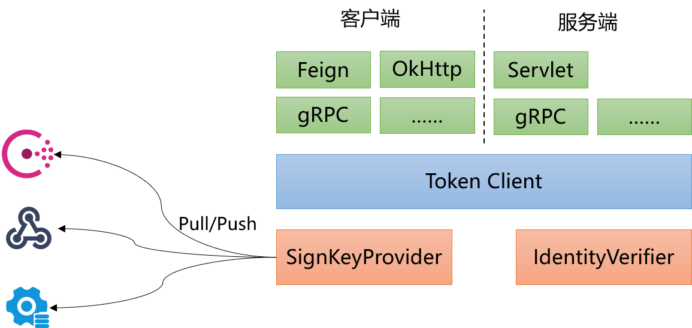

# auth-jwt
auth-jwt使用JWT对请求认证，提供开箱即用的插件以提升集成速度，同时提供颁发和校验token的基础能力。auth-jwt初始开发目的是用于微服务系统内部微服务之间的互相认证，当然auth-jwt可以轻松扩展以使用其他场景。

# 1 快速开始

## 1.1 创建、校验Token

`TokenClient` 依赖`SignKeyProvider` 提供签名token的key，`IdentityVerifier`对token中的身份进行校验。要想使用该功能需要引入相关依赖：

~~~xml
<dependency>
    <groupId>io.github.ctlove0523.auth.jwt</groupId>
    <artifactId>auth-jwt-core</artifactId>
    <version>${version}</version>
</dependency>
~~~

> version根据实际情况填写

### 1.1.1 创建`SignKeyProvider`：

~~~java
SignKeyProvider signKeyProvider = new SignKeyProvider() {
	@Override
	public String getSignKey() {
		return UUID.randomUUID().toString();
	}

	@Override
	public void registerHandler(SignKeyChangeHandler handler) {
		// no op
	}
};
~~~

上面创建的`SignKeyProvider` 返回一个UUID作为key，并且不支持注册key变化处理器。

### 1.1.2 创建`IdentityVerifier`：

~~~java
IdentityVerifier identityVerifier = identity -> true;
~~~

上面创建了一个不对身份进行任何校验的`IdentityVerifier`

### 1.1.3 创建`TokenClient`：

~~~java
TokenClient tokenClient = TokenClient.newBuilder()
	.withSignKeyProvider(signKeyProvider)
	.withIdentityVerifier(identityVerifier)
	.build();
~~~

### 1.1.4 生成校验token

~~~java
// 创建一个携带identity的token
Identity identity = Identity.newIdentity().setId("your id");
String token = tokenClient.getToken(identity);

//校验token，可以从checkResult判断是否合法，已经不合法的原因
TokenCheckResult checkResult = tokenClient.validToken(token);
~~~

## 1.2 使用auth-jwt-servlet-filter对web请求认证

### 1.2.1 引入相关依赖：

~~~xml
<dependency>
    <groupId>io.github.ctlove0523.auth.jwt</groupId>
    <artifactId>auth-jwt-servlet-filter</artifactId>
    <version>${version}</version>
</dependency>
~~~

> version根据实际情况填写

### 1.2.2 注册Filter

~~~java
@Bean
public FilterRegistrationBean<Filter> registerSecondBean(TokenClient tokenClient) {
	FilterRegistrationBean<Filter> filter = new FilterRegistrationBean<>();
	filter.setFilter(new AuthJwtFilter(tokenClient));
	filter.setName("third filter");
	filter.setOrder(1);
	filter.setUrlPatterns(Arrays.asList("/application"));
	return filter;
}
~~~

# 2 架构

auth-jwt的整体架构非常的简单，auth-jwt整体划分为三层：SignKeyProvider+IdentityVerifier，Token Client和适配器。

SignKeyProvider：获取签名token的key，key变化时通知监听器。

IdentityVerfier：对token中携带的身份信息进行校验

Token Client：核心组件，创建、校验token

适配器：适配各种client、server，提供开箱即用的插件。

# 报告bugs
如果你在使用过程中遇到任何问题或bugs，请通过issue的方式上报问题或bug，我们将会在第一时间内答复。上报问题或bugs时请尽量提供以下内容：

使用的版本，使用场景，重现问题或bug的样例代码，错误信息

# 贡献
该项目欢迎来自所有人的pull request。
